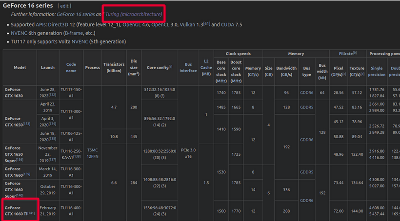
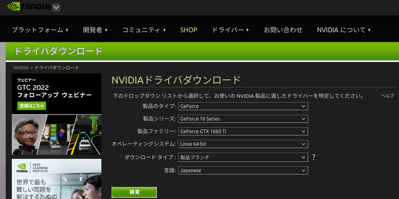
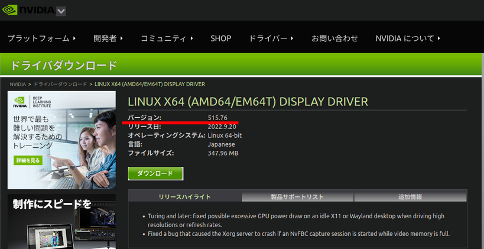
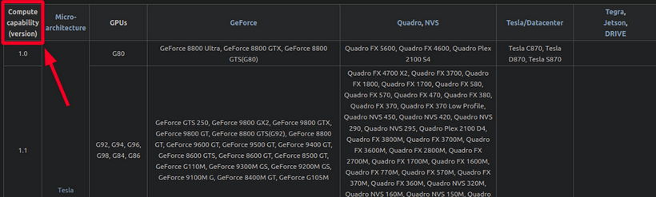
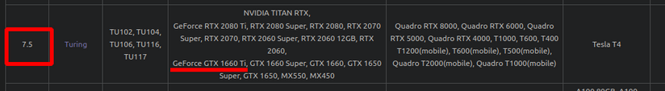
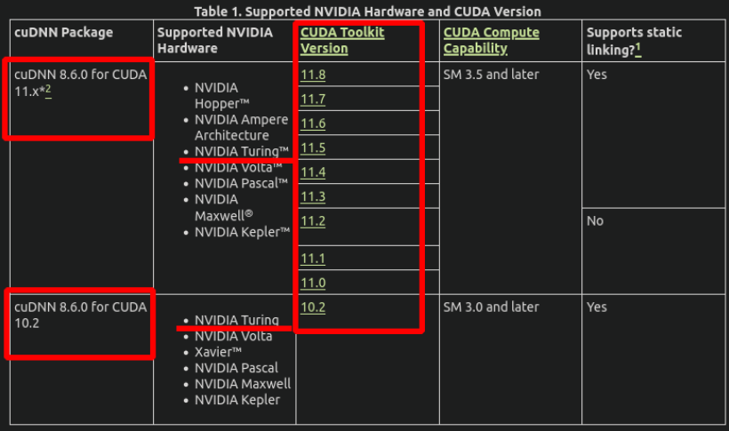
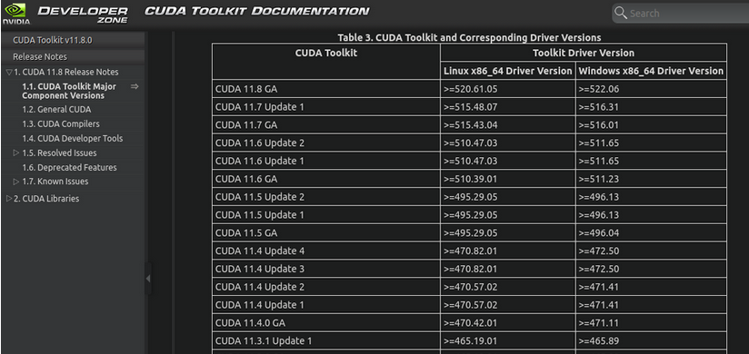
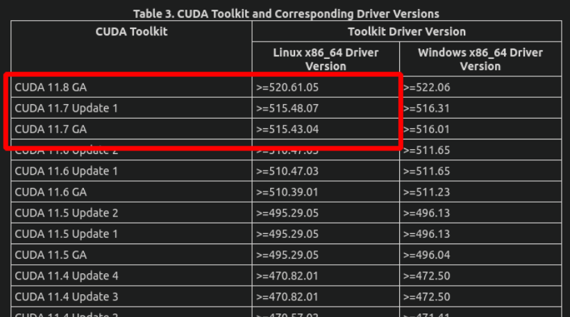
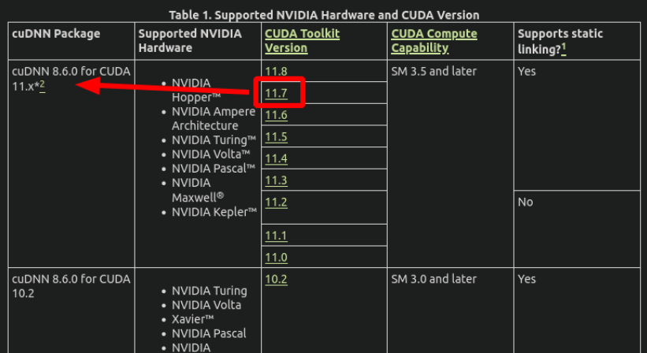

# title
Nvidia driver, CUDA Toolkit, cuDNNにおけるバージョン組み合わせ解の解き方
# 環境
```bash
$ inxi -SCGxx --filter
System:    Kernel: 5.15.0-46-generic x86_64 bits: 64 compiler: N/A Desktop: Unity wm: gnome-shell dm: GDM3 
           Distro: Ubuntu 20.04.4 LTS (Focal Fossa) 
CPU:       Topology: Quad Core model: AMD Ryzen 5 1400 bits: 64 type: MT MCP arch: Zen rev: 1 L2 cache: 2048 KiB 
Graphics:  Device-1: NVIDIA TU116 [GeForce GTX 1660 Ti] vendor: Micro-Star MSI driver: nvidia v: 515.65.01 bus ID: 08:00.0 
```

# これはなにか
Ubuntu 20.04においてNvidia driverなどのインストールは半分自動的に行われます。
```bash
$ wget https://developer.download.nvidia.com/compute/cuda/repos/ubuntu2004/x86_64/cuda-keyring_1.0-1_all.deb
$ sudo dpkg -i cuda-keyring_1.0-1_all.deb
$ sudo apt-get update
$ sudo apt-get -y install cuda

$ apt-get install -y nvidia-cuda-toolkit
$ apt-get install -y libcudnn8
$ apt-get install -y libcudnn8-dev
$ apt-get install -y libcublas
```
ところが推奨インストールされるドライバーなどのバージョンではシステムが正常に動かないことがまれにあります。
そうした時の処方箋です。
# 結論
1. 以下の情報を確認
    - GPUカードのアーキテクチャ(microarchitecture)
    - ディスプレイドライバのバージョン
    - Compute Capabilityの数値
    - CUDA Toolkitのバージョン
    - cuDNNのバージョン
    - 集めた情報を整理する

2. 確認した情報をもとに導入

# 詳細
1. アーキテクチャを調べるには
   1. [List of Nvidia graphics processing units](https://en.wikipedia.org/wiki/List_of_Nvidia_graphics_processing_units)からお使いのGPUカードを検索してください。例えばGeForce 1660tiならば以下の画像のように表示されますので「アーキテクチャ = Turing」と分かります。
   
2. ディスプレイドライバのバージョンを知るには
   1. [NVIDIAドライバダウンロード](https://www.nvidia.co.jp/Download/index.aspx?lang=jp)にアクセスして持っているビデオカードやOSの種類を選択して検索ボタンを押すと、どのドライバが良いか結果を出してくれます。ダウンロードタイプは「製品ブランチ」を選んでください。
   
   
3. GPU Compute Capabilityを知るには
   1. [GPUs supported](https://en.wikipedia.org/wiki/CUDA#GPUs_supported)の項のテーブルから検索します。
   
   たとえばGeForce GTX 1660 Tiなら「7.5」であることが分かります。
   
4. CUDA Toolkitのバージョンを知るには
   1. [cuDNN Support Matrix](https://docs.nvidia.com/deeplearning/cudnn/support-matrix/index.html#abstract)を参照してアーキテクチャから調べます。CUDA Compute CapabilityはGPU Compute Capabilityのことです。上述したとおり「7.5」なのでここでは複数のバージョンを選べるよということになります。
   
   どれを選ぶかは上述した「ドライバのバージョン」を参考にします。
   [Table 3. CUDA Toolkit and Corresponding Driver Versions](https://docs.nvidia.com/cuda/cuda-toolkit-release-notes/index.html#cuda-major-component-versions__table-cuda-toolkit-driver-versions)を参照してください。
   
   ちなみにこのページは頻繁に更新されリンクも途切れやすくなっています。もしご自身のブックマークがリンク切れになった場合は「CUDA Toolkit Documentation」をキーワードとして検索してください。
   
   上の図より、ディスプレイドライバ「515.76」に対応するCUDA ToolkitのバージョンはCUDA 11.7であることが分かりました。
   
5. cuDNNのバージョンを知るには
   1. 上述の「Table 1. Supported NVIDIA Hardware and CUDA Version」からcuDNNのバージョンは「8.6.0」ということが分かります。
   
6. 集めた情報を整理する
   1. 以上の作業から必要となるバージョンはこのようになります。
       - ディスプレイドライバのバージョン
           - 515.76
       - CUDA Toolkitのバージョン
           - 11.7
       - cuDNNのバージョン
           - 8.6.0


# 参考リンク
https://tokai-kaoninsho.com/face-recognition-software/%e7%92%b0%e5%a2%83%e6%a7%8b%e7%af%89-face-recognition-software/gpu%e5%b0%8e%e5%85%a5/
# あとがき
Zennでの記事は参考リンクを簡略化して転載しました。
Nvidia GPUまわりは少し時間が経つと色々と変わります。公開鍵が変更されていたり`ubuntu-drivers autoinstall`が非推奨になっていたり。環境構築自動化スクリプトを走らせた時に「なんだこれおかしいぞ」と気づくわけです。ディスプレイドライバまわりのバージョンを固定し忘れていると思わぬバグに遭遇したり。バージョン固定が正しいかというとそうでもなくて、時間が経つにつれ他のライブラリとの乖離が大きくなって不具合の原因になったことがあります。そういうわけで色々選択肢がありすぎるバージョン組み合わせを手作業で確認するマニュアルが必要と思い記事にしました。
お読み頂きありがとうございました。